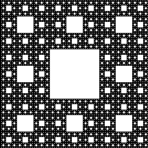
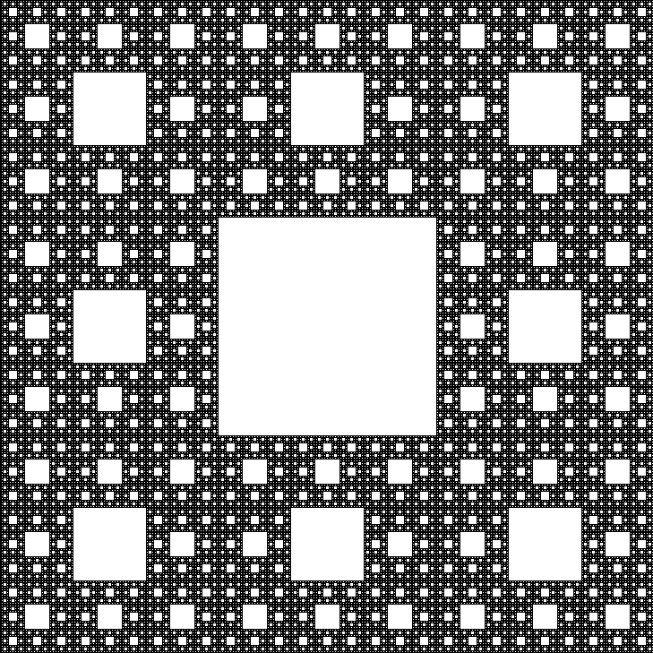
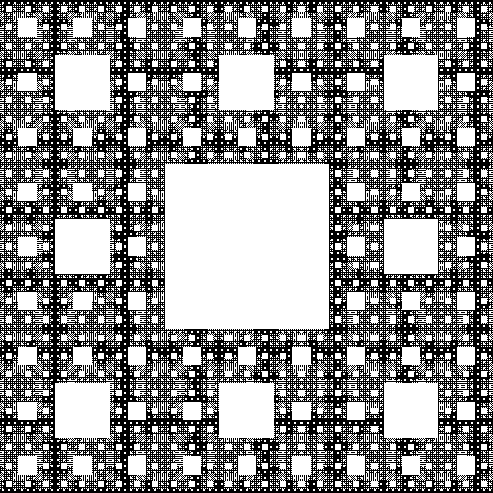

# Images of n-th iteration
### 5th iteration

### 6th iteration

### 7th iteration

#### Output will be image of n-th iteration in .ppm format, which are known for it's huge size. Solution = convert to .png.